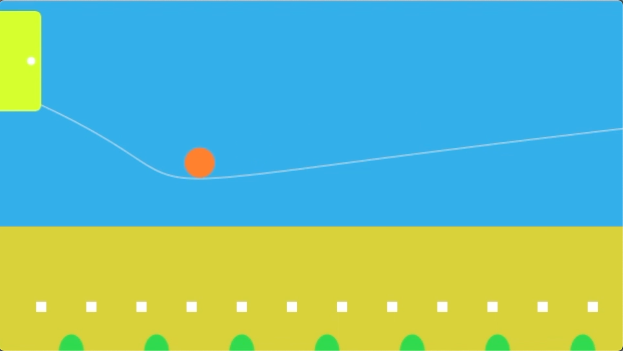

# Here is assignment two
## "Playground"
- Here's the video of my work.  <li><a href="https://www.youtube.com/watch?v=W10grUKg4AY" >Playground</a></li> 
 
- Here is a screenshot. 

 
### Description:
- Goal: create an animation for children
- Elements: A curve, a ball that moves along the curve, a door at the end of the curve, a playground, some obstacles, free bushes, and some interactive features during the animiation.  
- Shapes: "eliipse" "bezier" "arc" "rectangle" ""
- Tools: "void setup" "void draw" "fill" "stroke" "if...else" "while" "for"

### Difficulties:
- Finding the right coordinates for each shapes was time-comsuming. 
- It also was hard to determine the exact functions to move the ball along the curve. 
- There were multiple times when the system showed errors (i.e. somehow the new code was in conflict with the previous ones), but I couldn't figure out what was wrong and have to change my plan. 
- I am still trying to figure out how to better apply "while" loops and "for" loops. 

