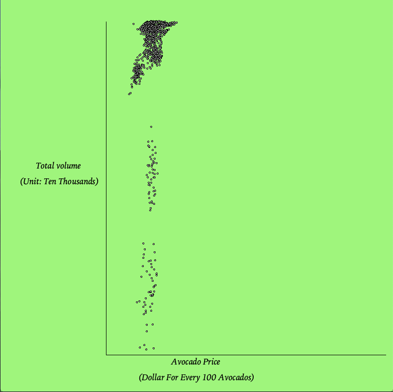
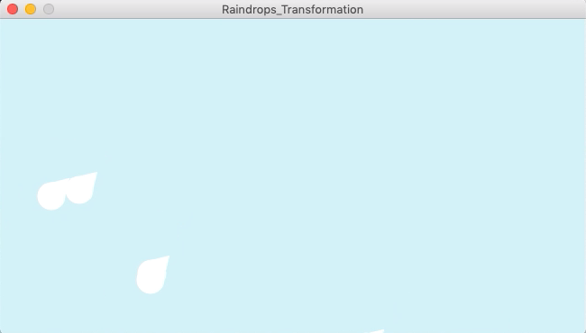
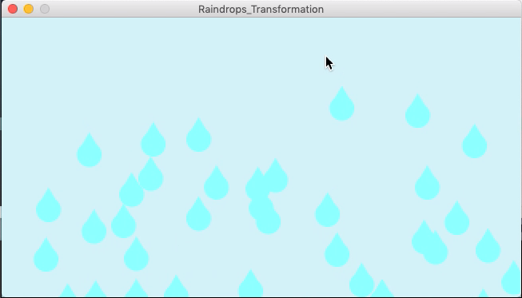
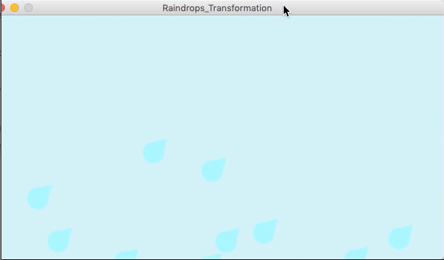
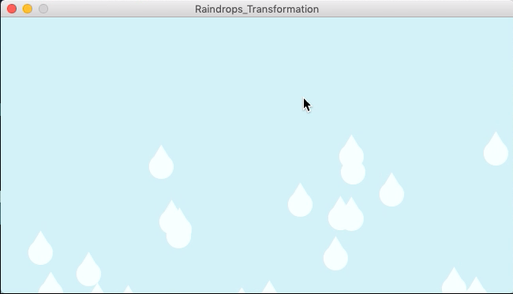

# Assignment 5 by Chenyu (Due June 7, 2020)
## Data Visualization (Avocado Prices):
Here is the video of my work:
<https://youtu.be/rnqDjuCUydk>

Here are a few screenshots:

### Description:
- Goal: Create a graph about Avocado prices to demonstrate its relationship with the total volume. 
- Coding Process:
  - 1) Create an instroduction page with "PFont" "text" "loadImage", "String", and use "keyPressed" to control the flow from the introduction page to the main page
  - 2) Creating a class as the main page (i.e. Coordinate system and data points) with "lines", "table", "loadTable", "TableRow" "getFloat", and "ellipse", and use the same method to label x and y axis. 
- Instructions for usage: Pressed any key to jump from the introduction page to the main page and the graph will automatically show up. 
  - 3）The unit for x axis is Dollar for every 100 avocados and the unit for y axis is ten thousand. 
- The source of data: <kaggle.com/neuromusic/avocado-prices>.

### Difficulties and Challenages:
- 1) When I first created the introduction page and the main page without "keyPressed" function, the introduction page only retain around 1 sec before juming to the main page. I tried to use delay but it did not work, so I decided to try "keyPressed".
- 2) It was little bit confusing to organize such a huge amount of data that fits the proper size, so I decided to cut down the number of data to 1000 and manipulated the unit of my x and y values. 
- 3) I did not know that I could use table instead of string at the very beginning, and I spent a lot of time trying to separate the array with commas. 

## Transformation (Raindrops):
Here is the video of my work:
<https://youtu.be/r2ZNYvqUpjc>

Here are a few screenshots:

### Description:
- Goal: Use transformation to rotate the raindrops and the positions of some raindrops as they fall by pressing any keys. 
- Coding Process: 
  - 1) I used my assignment from last time. 
  - 2) I applied that transformation (i.e. "translate","rotate", "pushMatrix", "popMatrix").
  - 3) I created variables x and y and made the raindrops any colors. 
- Instructions for usage:
  - 1) Press any key to change from normal state to transformed version. 
### Difficulties and Challenages:
- I was trying to change the raindrops' colors after some of them are roated and changed positions; however, I still wasn't able to do it at the end. 
