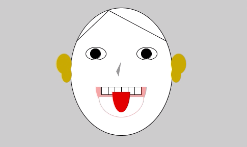

#Assignment 1: Self-Portrait
- Overall Description: it is a protrait of me using basic shapes (cicle, rectangle, triangle, arc, ellipse, line) and basic tools (fill, stroke)
  - Ellipse and circle are used to draw my face and my eyes, as well as my ears
  - Arc is used to draw my mouth and tougue
  - Rectangle is used to draw my tooth
  - Triangle is used to draw my nose
  - Line is used to draw my hair
  
- Here is a picture of my project

- Here is the video of the whole process
  <li><a href="https://youtu.be/rYEdizdQyB0" >Self-Portrait</a></li>
- Major Diffiiculties
  - It was hard to determine the exact location to put my shapes. I had to try multiple times before finding the correct coordinates. I had difficulties to color an area that is a within the shape. For example, my hair is drawn with two lines on my face. I wanted to make my hair black, but it was hard to fill the area outlined by my upper face and the two lines. 
 
   
 
