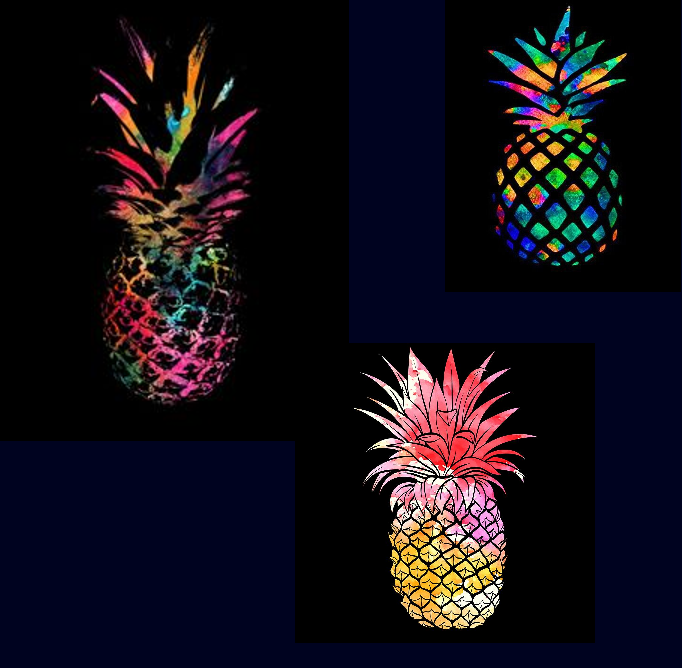

# Assignment 6
## Image Manipulation: "MixedPineapples"
- Here is a video of my work:

<https://youtu.be/NI2T8kLTZBA>

- Here are some screenshots:

### Description:
- 1) I used three pineapple pictures, and cut a portion out of each image, and combine them together to form a new pineapple.
- 2) Tools: 
  - I first used "PImage" to create a class of images; 
  - I then made an array and "for loop" to display each image.
  - After that, I used the .get action to cut a portion out of each image.
  - At the end, I adjust their postions and use "keyPressed" to control the effects. 
### Difficulties:
I spent a lot time trying to figure out change the size of the curout image after adding keyPressed function. 
I was able to do it with the class example, but struggled to achieve the same with my project. 
The probelm ended up being that I have to adjust the size at the end, instead of doing it before the "if..else" function. 

